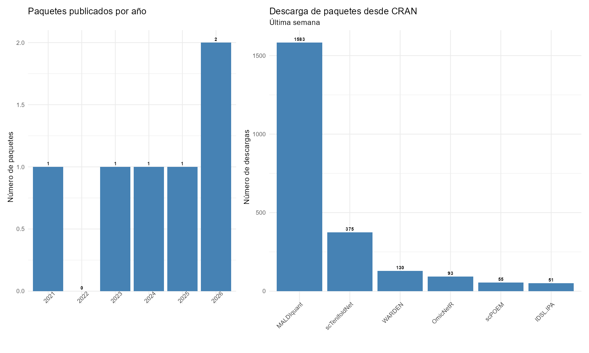
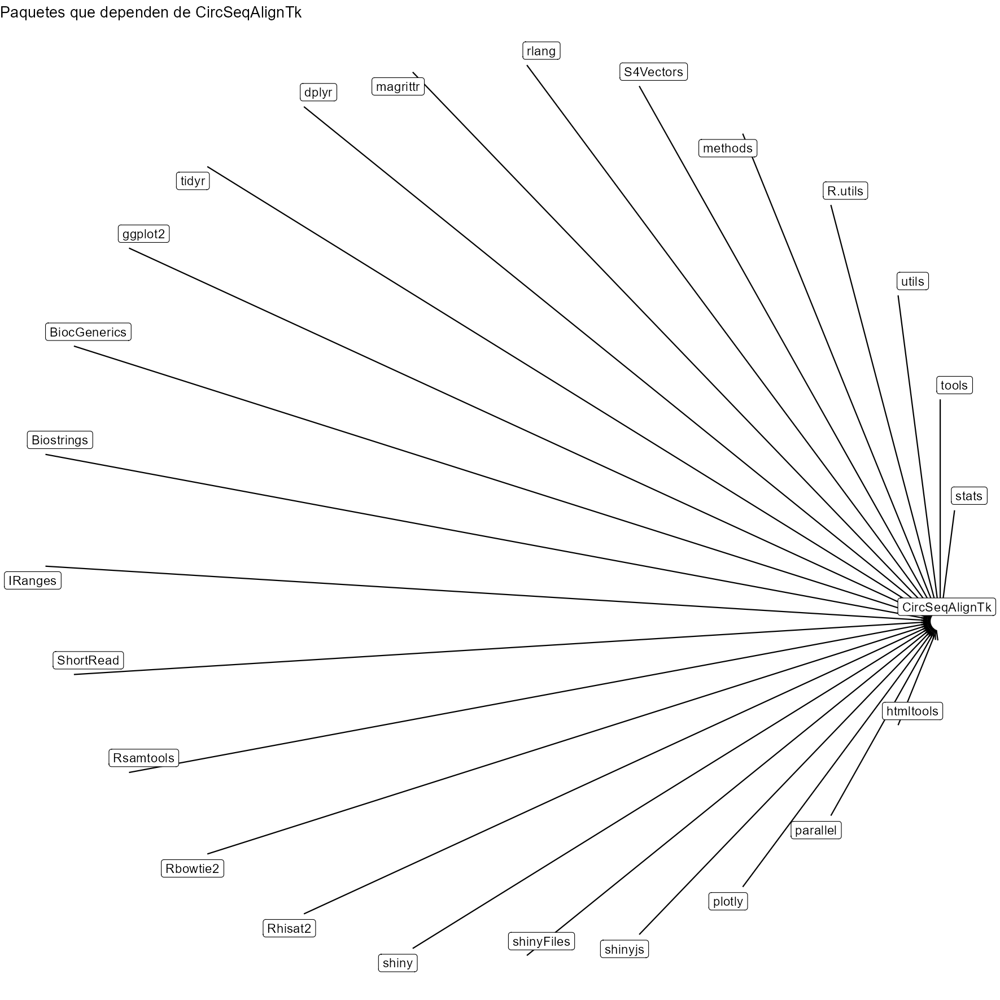
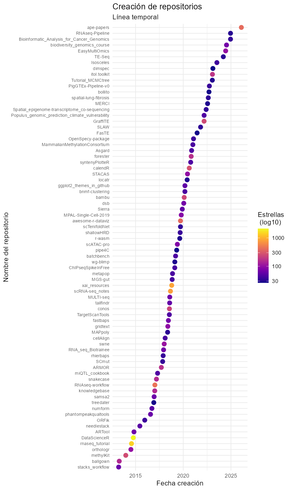

# Revisión sistemática de repositorios para el lenguaje R (CRAN, GitHub, Bioconductor)
por: [Antonio Jesús Canepa Oneto](https://github.com/ajcanepa) y [Claudia Fernández Ruiz](https://github.com/cfr1012)

### Introducción
En este repositorio se muestra el código de la nota ecoinformática homónima, disponible aquí [Actualizar codigo.]

### Objetivos
El principal objetivo es proveer de una guía de exploración o consulta sistemática de los repositorios más comunes del lenguaje de programación R, como son [CRAN](https://cran.r-project.org/), [Bioconductor](https://www.bioconductor.org/) y [GitHub](https://github.com/).

La nota provee de funciones y un código detallado que permiten hacer una búsqueda sistemática, mediante queries estructuradas, en los tres repositorios mencionados y crear visualizaciones como:

* Listado de paquetes creados y descargados en CRAN

***

* Gráfico de dependencias de paquetes en Bioconductor

***

* Fecha de creación y número de estrellas de paquetes en GitHub

***
